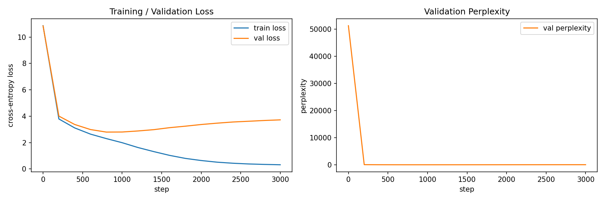

# GPT-2 from Scratch — WikiText-2로 학습하기

PyTorch만 사용해서 GPT-2 아키텍처를 처음부터(from scratch) 구현하고, WikiText-2(raw) 데이터셋으로 직접 학습시킨 프로젝트입니다.

Colab 무료 GPU(T4)에서 바로 돌릴 수 있도록 모델 크기와 학습 설정을 맞췄습니다.

## 1. 프로젝트 구조

gpt2-from-scratch/
├── config/
├── data/
├── model/
├── notebooks/
└── results/
    ├── training_curves.png
    └── training_log.json

## 5. 학습 결과

### 📊 Training Curves

### 📈 최종 지표 (Final Metrics)
- **최종 Validation Loss**: 3.7231
- **최종 Validation Perplexity**: 41.39

### ✍️ 텍스트 생성 예시 (Generated Text Sample)
> The history of the United Statesvd newlyooks filename analytical programming Pennyogether module restrictingNavOU breedingliedilleollah Mystery governed Creationbody prostate dismay246 Attack Constitutional congressmanLic coral newlyazeera tx meetingsBuilding Dictionary315 edition adren Constitutional315 edition Tas wrathMulti AlbanyOU vividimgur rocketsbodysystem moleculestenExcept tox Florence 1997 adren molecule filename conviction315 tox Constitutional YasLicNav315 edition allowance295 log WiFi meetings Constitutional analytical guiding newly Constitutional congressmanmounted mushroom 1997 Voting objected315 tox adren Constitutional!, autoitars programming Constitutional analyticalmounted.